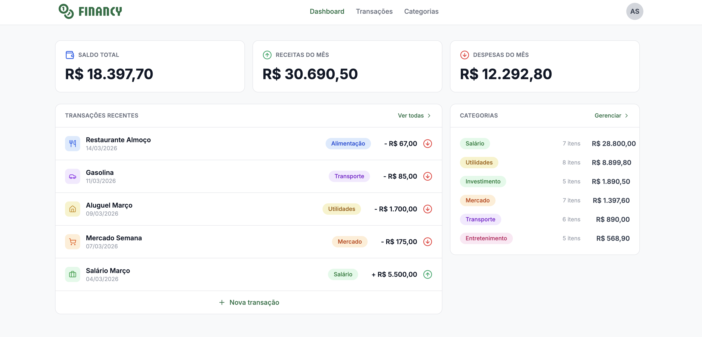

# Financy — Gerenciador de Finanças

Aplicação fullstack de gerenciamento de finanças pessoais, desenvolvida como desafio da Pós 360 da Rocketseat. Permite cadastro de transações e categorias, com dashboard de resumo financeiro.

> Descrição completa do desafio em [DESAFIO.md](DESAFIO.md)

---

## Prints


---

## Funcionalidades

- Autenticação com cadastro e login
- Cada usuário gerencia apenas suas próprias transações e categorias
- Criação, edição e exclusão de transações
- Criação, edição e exclusão de categorias
- Dashboard com resumo financeiro (entradas, saídas e saldo)
- Listagem de transações com paginação
- Filtros por período e categoria

---

## Tecnologias

### Back-end

| Tecnologia | Uso |
|---|---|
| TypeScript | Linguagem principal |
| Node.js + Express | Servidor HTTP |
| Apollo Server | Servidor GraphQL |
| GraphQL | API de consultas e mutações |
| Prisma | ORM e migrations |
| SQLite | Banco de dados |
| JWT | Autenticação |
| bcryptjs | Hash de senhas |

### Front-end

| Tecnologia | Uso |
|---|---|
| TypeScript | Linguagem principal |
| React 19 | Interface |
| Vite | Bundler |
| Apollo Client | Consumo da API GraphQL |
| React Router | Roteamento |
| TailwindCSS | Estilização |
| Shadcn/ui (Radix UI) | Componentes |
| React Hook Form + Zod | Formulários e validação |
| Recharts | Gráficos |

---

## Como rodar localmente

### Pré-requisitos

- Node.js 18+
- npm

### Back-end

```bash
cd backend

# 1. Instalar dependências
npm install

# 2. Configurar variáveis de ambiente
cp .env.example .env
# Edite o .env e defina um valor para JWT_SECRET (ex: minha-chave-secreta)

# 3. Rodar as migrations
npm run db:migrate

# 4. (Opcional) Popular o banco com dados de exemplo
npm run db:seed

# 5. Iniciar o servidor
npm run dev
```

O servidor GraphQL estará disponível em `http://localhost:4000/graphql`

### Front-end

```bash
cd frontend

# 1. Instalar dependências
npm install

# 2. Configurar variáveis de ambiente
cp .env.example .env
# O .env já vem configurado com: VITE_BACKEND_URL=http://localhost:4000

# 3. Iniciar a aplicação
npm run dev
```

A aplicação estará disponível em `http://localhost:5173`
